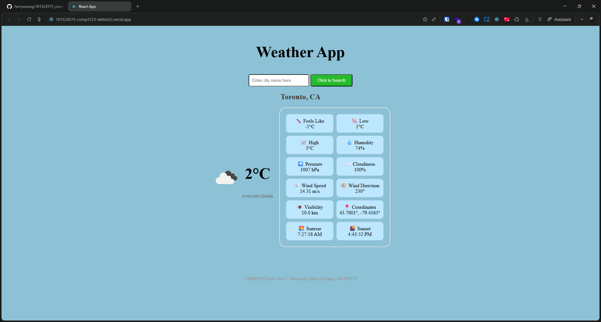
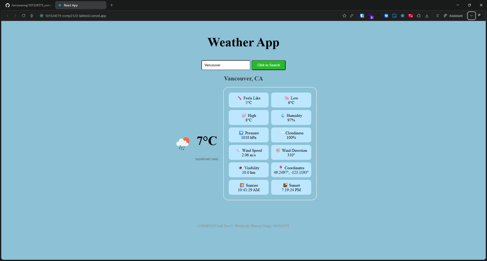

## Weather App - COMP3123 Lab Test 2

**Student:** Woohyuk (Harry) Song  
**Student ID:** 101524575


## Project Description

React application displaying weather stats for an entered city using the OpenWeatherMap API.


## Setup

1. Clone the repository:
```bash
   git clone https://github.com/yourusername/101524575_comp3123_labtest2.git
   cd 101524575_comp3123_labtest2
```

2. Install dependencies:
```bash
   npm install
```

3. Start the development server:
```bash
   npm start
```

4. Browser should automatically navigate to: `http://localhost:3000`. If not, manually navigate to the link.

## API Used

**OpenWeatherMap API**  
- Documentation for Endpoint: https://openweathermap.org/current
- API Key: Included in the project code

## Screenshots

### Main Interface

*Default view showing Toronto weather*

### Search Functionality

*Searching for a different city*


## Notes & Assumptions

- The app fetches Toronto weather data on initial load as the default city
- Weather icons are dynamically loaded from OpenWeatherMap based on current conditions
